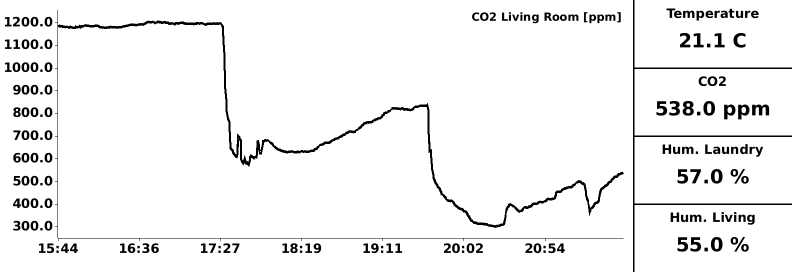
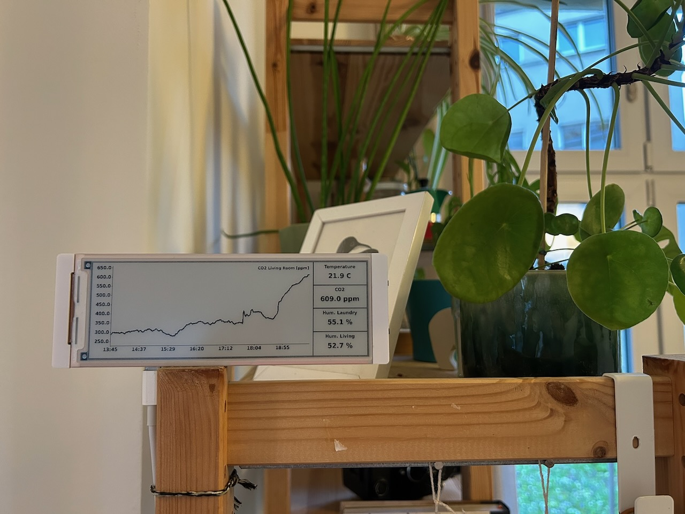

I've been collecting CO2 concentration, humidity, temperature and other properties of our apartments
air for some time now. That data only lived in a ClickHouse instance with a Grafana dashboard to
view it, but I've been missing a physical display for other people to view (and appreciate) the
data. So I've finally set out to build a little ePaper dashboard.

At first I wanted to use an old Kindle Paperwhite I had laying around from years ago and build a
little frontend application that renders charts using a plotting library. Then I realized that my
kindle was so old that it couldn't run javascript to the extent required to chart data. Instead, I
found
[this ePaper device](https://www.elecrow.com/crowpanel-esp32-5-79-e-paper-hmi-display-with-272-792-resolution-black-white-color-driven-by-spi-interface.html)
by Elecrow for 30 bucks. It includes an ESP32-S3 to control the display. The original plan was to
expose an endpoint from a service connected to the ClickHouse DB that serves the data I want to show
on the dashboard. Then, the ePaper device would consume this data and render charts and values.

Once I started looking at the library the manufacturer ships to draw to the screen it didn't take
long to realize that this wasn't going to be so easy. Between all the comments in chinese it became
clear that rendering an image on the server and merely painting that to the ePaper screen is the
preferrable way. If I went this way from the start, I probably could have made the Kindle work after
all, although maybe still requiring jailbreaking.

Either way, I've now built an endpoint in my Rust service that renders an image comprised of a main
CO2 chart as well as a couple of scalar values like current temperature, humidity as well as -
crucially - the current humidity in our laundry room.

The CrowPanel device then loads this image every 2 minutes and paints it to the screen.
Unfortunately I didn't get deep sleep working without the screen somehow showing weird banding, so
the device currently just sits around in between cycles. If you care to see the code on the device,
you can [find it here](https://github.com/beingflo/embedded-v2/blob/main/dashboard/dashboard.ino).
The code that renders the image can be found
[here](https://github.com/beingflo/events/blob/main/service/src/dashboard.rs). All being said and
done, I've now set up the device in kind of a hallway in our apartment (in an admittedly janky way,
I'll think of a more permanent fixture one day, surely).

On a side note, both the rendering code as well as the embedded code was heavily vibe-coded.
Iterating on the rendering in particular worked very well. On the embedded side, despite having
access to the whole drawing library and a bunch of example code, it took a lot of churning to get
usable code. And even then, the device occasionally just seizes up, probably the error handling with
Wifi connectivity is flaky, or there may even be a memory leak. I'll need to manually look into
this.
