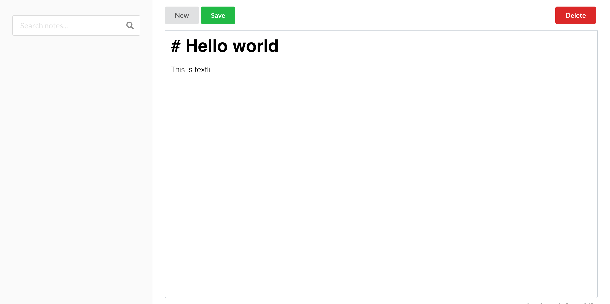
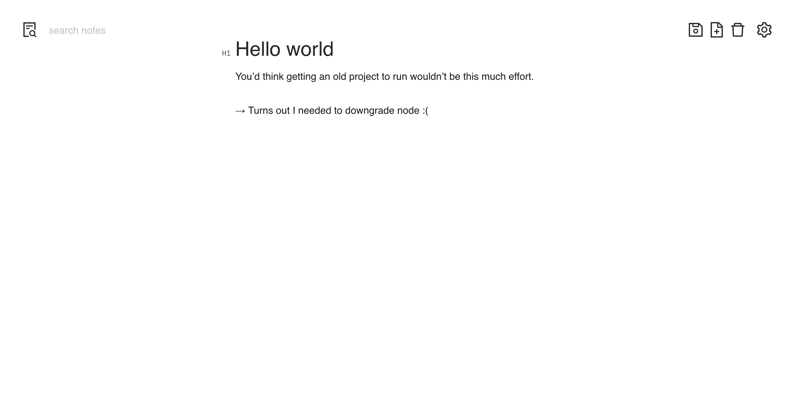
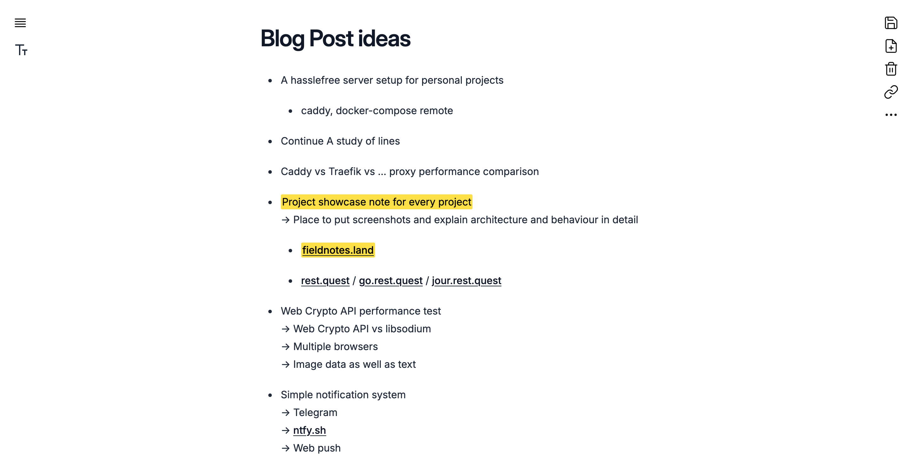
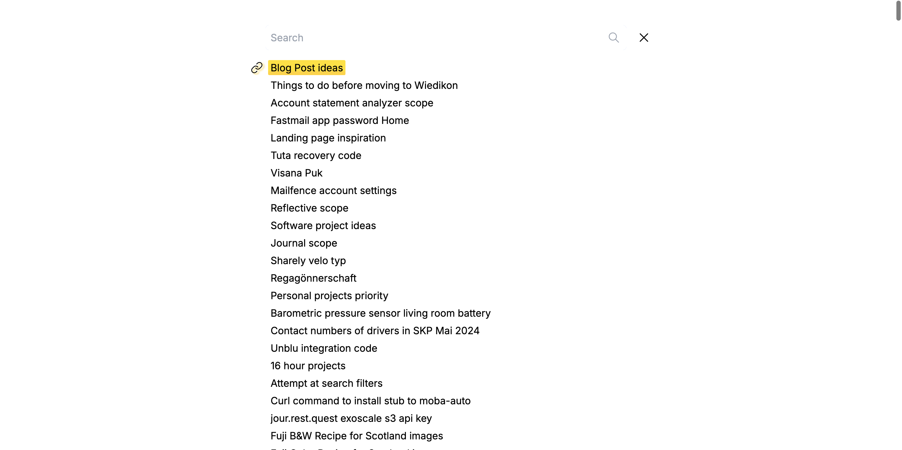
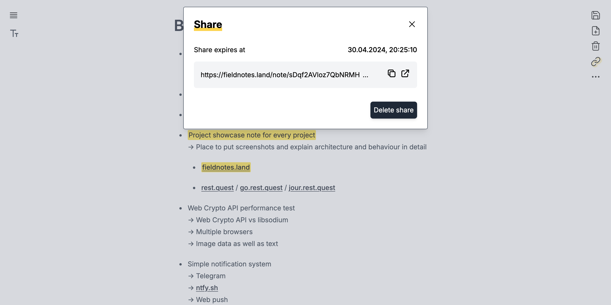
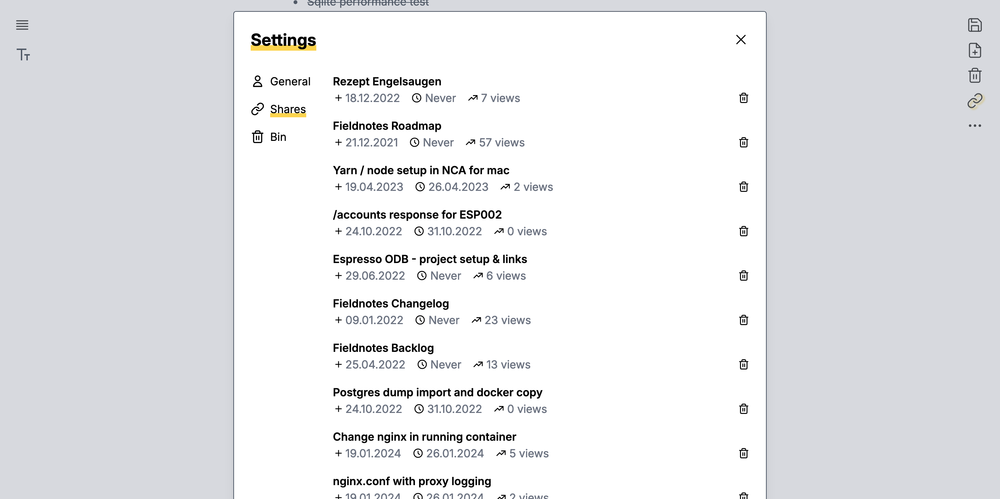
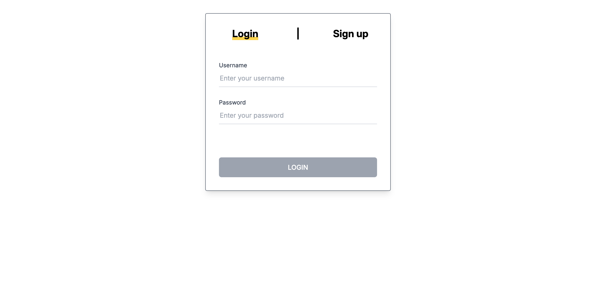
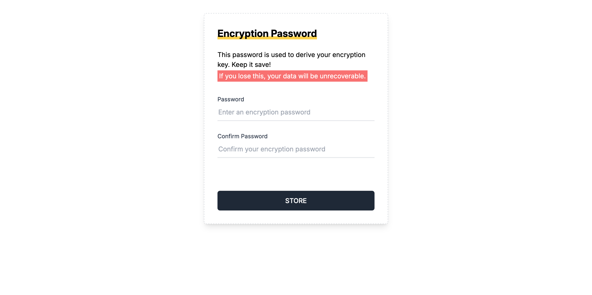

import { Details, Hint, Warn } from 'src/components';

Some years ago, I got very serious about upping my privacy game. From Gmail and Google Drive
to cloud-based note-taking applications, I wanted to stop giving all my data to companies that
would monetize it. The first order of business was to replace my haphazard use of Google Keep
with a private note-taking application.

My requirements were simple: Allow low-friction editing, a clean UI, and end-to-end
encryption. To my surprise, I could not find a single application that fulfilled all three. So
instead I set out to create my own. Over the next year or so, I embarked on a tumultuous
journey to build my first "large-scale" full-stack application.

<Details title="What's a project report?">

I intend to start a series of notes detailing the thought process going into my applications
and the resulting concepts and architectures. Ideally, I would write these as I am building
the application, but since this one has been built way before this website even existed,
I'll have to do it retrospectively.

Hopefully, I'll be able to detail my journey from novice to experienced fullstack engineer
in this format. It may also serve as another chance to reflect on what worked well and what
didn't in my various projects.

An inspiration for starting this, by the way, was
[this blog post on taking screenshots](https://alexwlchan.net/2022/screenshots/).
Writing these notes will force me to document my application in a format that is more likely
to be viewable in the future. My trouble to get an old version of fieldnotes running just to
take a screenshot emphasizes that point.

</Details>

## A brief recap

The very first version of this application I built featured a simple Python server storing
notes as files on disk. It didn't support multiple users and protected access using hardcoded
basic auth. My frontend experience at this point consisted of approximately 2 months of
on-the-job React usage. So I built the UI using React, the only way I knew how: Prop drilling.
For UI components I used [Semantic UI](https://semantic-ui.com/). Looking back at
this code my eyes start to bleed. Anyhow, this is how it looked:



It was simple but functional, I was hosting it on a Raspberry Pi in a shoebox. At this stage,
there was no encryption. Since I was self-hosting and thus was the only person with access to
the data, I figured there was no point.

I quickly outgrew this code base and started rewriting it. This time the backend was
implemented in Rust with a MongoDB database. The frontend was still React, but this time
making use of some more sophisticated state management: Context. Also, I switched to the
[Ant Design](https://ant.design/) UI component library. This is also the point where
I started hosting my applications on a VPS rented in a datacenter. So long, trusty shoebox RPi.

Trying to start this application locally to get a screenshot turned out to be quite hard. So
much for the longevity of frontend code bases.



But v2 was not even deployed when I got the itch to rewrite again. I gave in and built the
application using Rust and PostgreSQL in the backend and React with Jotai state management in
the frontend. This time around I used [Tailwind CSS](https://tailwindcss.com/)
with [Headless UI](https://headlessui.com/) components. This turned out to be the stack
that stuck. This is what it looks like today:



I find it amazing to look back on these 3 versions of the same application and reflect on my
progress both technically as well as visually. You can see my minimalistic style preference
forming in real-time. And my technical preferences are materializing just as I'm using
different approaches and figuring out better ways.

In the following, we will only consider the latest iteration and talk through architecture and
design decisions.

## Features

[Fieldnotes](https://write.fieldnotes.land) currently boasts the following features:
Low-friction editing, minimalistic and elegant UI, end-to-end encryption, and private note sharing.

Searching for notes (cmd+k) opens an overlay with a flat list of all notes. Due to the e2e
encryption, only note titles can be searched here.



Notes can be shared privately via a share dialog. The user can choose how long the share link
should stay active for.



In the settings, a list of all shares can be viewed. The backend keeps track of how many times
a share has been viewed.



Authentication is handled by the backend in a hand-rolled auth system. Only username /
password is supported, reset emails are not implemented.



Upon login for the first time on a device, the user is prompted for an additional password
that is used to derive a key for encryption. More about this in a later section.



### Non-features

While I now consider Fieldnotes feature complete for my purposes, it's fun to look back at
aspirations I had for it at one point. Looking at an ancient `Fieldnotes Roadmap` note I have
in Fieldnotes, I was thinking about collaborative editing, versioning of notes, image upload to
s3 (to avoid blobs in the DB), note cross-linking, and even a hosted personal blog site powered
by published notes. To think I was about to reinvent a CMS by accident makes me shudder a bit.

In hindsight, I'm happy to have cut the cord at the point I did. Arguably, even the sharing
functionality does not pull its own weight, I'm glad I didn't go further. Fieldnotes is
wonderfully functional in the state it is now.

## Architecture

<Details title="A disclaimer about completeness">
This project was such a massive learning experience, it's hard to put everything in writing.
Especially in retrospect. But I want to give one example to illustrate a train of thought
that is hard to comprehend with some experience under your belt.

Shortly before I started working on Fieldnotes, I was studing CS at university with a focus
on high-performance computing. I had no experience with web development whatsoever. When I
started conceptualizing the authentication system for this application, I was dumbfounded by
the thought of making an extra DB query every time _any_ request had to be authenticated
(think checking validity of session token). After all, I was just yesterday spending a lot of
time making sure my data is efficiently preloaded into cache, and now you're telling me I have
to wait a relative eternity for the DB to go read from disk before I can start doing any actual
business logic?

So I was feverishly researching how other people solve this problem. I set my eyes on JWT as
a means to be able to keep a key in memory and verify the validity of the signed token more
efficiently than going to disk. Everyone on the internet is trying to tell you not to do
that (mainly because revocation of a token is hard), but it remained very tempting.

Ultimately, it took an embarrasing amount of time to let it sink in that this extra round
trip to the DB does not matter much in such applications, when a network roundtrip is
involved and throughput is more important than latency. Turns out it's okay to stick with
established best practises unless you really know better. Now I'm sympathetic when I see a
novice ask a seemingly insane question on a forum, probably there are some underlying,
unarticulated assumptions that lead to a very wrong mental model.

There are other such detours that would make this note unnecessarily long if mentioned, just
know that there were many.

</Details>

At the core, the Fieldnotes backend is a simple CRUD (create, read, update, delete) app. It
stores all its data in PostgreSQL. For authentication, there are user and token tables that
store hashed credentials as well as session tokens. The frontend is a single-page application
built in React. It uses [Jotai](https://jotai.org/) for state management. The extensive
features of the note editor, like advanced formatting, markdown support as you type, and a floating
formatting bar are provided by the excellent [tiptap](https://tiptap.dev/). Most of
the standout functionality of Fieldnotes lives in the frontend. The most interesting feature,
worthwhile of getting into is the client-side encryption.

### Deriving the main key

When a user logs into the application on a new device for the first time, they are asked to
provide an additional "encryption" password. This password is used to derive what I call the
main key using [PBKDF2](https://developer.mozilla.org/en-US/docs/Web/API/SubtleCrypto/deriveKey#pbkdf2).
In other words, the password provides the initial key material to seed the creation of the
key. Now, the key is stored in the browser and can be used for encryption and decryption.

If the user attempts to use Fieldnotes on a different device now, entering the _same_
encryption password will result in the generation of the same main key, thus, allowing interoperability
between encrypted content from one device to the other.

At no point does the key stored in one device's browser leave the device.

### Encrypting a note

Now, let's consider what happens when a user wants to store a new note:

1. User writes a note and tries saving it
2. Client generates an encryption key for this note using [AES-GCM](https://developer.mozilla.org/en-US/docs/Web/API/SubtleCrypto/encrypt#aes-gcm)
3. Client encrypts content and metadata using encryption key with AES-GCM
4. Client wraps encryption key using main key with [AES-KW](https://developer.mozilla.org/en-US/docs/Web/API/SubtleCrypto/wrapKey#aes-kw)
5. Client sends cyphertext and wrapped key to backend for storage

Notable here is the inclusion of the "per-note" key, we will explore later how this is useful
for sharing notes without exposing your main key.

### Loading metadata

When loading the list of notes into the frontend, the application receives an array of
objects, each containing encrypted metadata and a wrapped key for this note. Now, we
[unwrap](https://developer.mozilla.org/en-US/docs/Web/API/SubtleCrypto/unwrapKey)
each note's key using the main key and use it to decrypt the metadata.

### Decrypting a note

To decrypt a note is very similar to loading metadata, with the exception that for this API
call, the backend also returns the full encrypted content of a note. This is decrypted using
the plain key for this note.

### Sharing a note

To share a note to a third party via only a link, we need to communicate all the information
needed to decrypt the note. This is done by embedding the _plain_ key of this particular
note as the [hash](https://developer.mozilla.org/en-US/docs/Web/API/URL/hash) of the
URL. So a shared link will look something like

```
https://fieldnotes.land/note/uUpZgnUOeamS6SefalXjVVYb5zXChGh1#yLOOY5rCqxL0eJaZYPFrU2NzwHWqf+kkzCXNYUVLnrI=
```
or simplified:

```
https://fieldnotes.land/note/NOTE_ID#NOTE_KEY
```

The client application now requests the note with `NOTE_ID` from the backend and then goes
through the decryption process using the plain `NOTE_KEY` found in the hash.

This should motivate the existence of the note key. One might consider encrypting notes
directly using the main key. However, to allow a third party to decrypt a note, you'd have to
provide the main key to them. That would allow them to decrypt _any_ note, not just the
one you shared, provided they can get their hands on them. By introducing a key for each note,
we can easily share that with the recipient of a shared link, without exposing all other notes.
There is also no privacy loss towards the backend, as the keys are wrapped by the main key before
ever leaving the device.

<Hint>
	Now that I'm writing this I realize that asymmetric encryption never crossed my mind here. That
	could also be an avenue to avoid sharing the main key directly. Although I believe encryption /
	decryption performance is significantly worse for asymmetric cryptography.
</Hint>

### Security considerations

There is a lot of well-established criticism for web-based applications trying to achieve
end-to-end encryption. The main issue is that you want to be able to audit the code of the
application to actually trust that the encryption happens as advertised. For native
applications that is doable but for web applications it gets more tricky: I get to send you a
new application every time you load the web app and I get to send a legitimate application to
the security researcher but a compromised one to you. So you just shouldn't really trust a web
app.

Nothing I did in my application changes that basic limitation. There is one thing that
improves the situation a bit in my opinion: Secure key handling with Web Crypto API. When you
have the browser generate a key for you, you can specify that the key is
[not to be handed out](https://developer.mozilla.org/en-US/docs/Web/API/SubtleCrypto/generateKey#extractable),
ever. Instead, you only get a handle on the key. With the handle, you can still carry out
encryption and decryption operations, but you can never exfiltrate the key in plain text. In
my opinion as a non-specialist in security questions, that means you only have to trust the
web app on the first use. After that, even I can not maliciously extract that key. (I can
still carry out decryption operations in your browser that you didn't want to happen, though)

<Warn>
	Web Crypto API is a fairly low-level API and experts on the internet warn against using it if you
	don't know what you're doing. I don't know what I'm doing. I hope it's still secure.
	[Here](https://github.com/beingflo/write.fieldnotes/blob/main/src/components/crypto.ts) is the
	relevant code in my repo, do let me know if something is wrong.
</Warn>

## Deployment

Fieldnotes is deployed using docker-compose to a small Hetzner VPS. SSL for the domain is
handled by Caddy. It also serves as a web server for the static frontend bundle as well as a
proxy for the backend API.

## Learnings

Building this application (or rather 3 applications that happen to do the same thing) has been
an educational roller coaster. It helped me develop skills significantly faster than if I only
did engineering on the job. But most importantly, it kick-started my appetite for side
projects!

To also mention some concrete lessons: By the third iteration of Fieldnotes I learned that I
should deploy a "Hello world" application first things first. Building things locally and
waiting for the right moment to deploy is futile: That moment never arrives. Now I'm firmly in
the MVP camp. My applications got significantly leaner and I really ponder if a feature pulls
its own weight.

Lastly, when the application started to be pretty useful and fun to use, I started imagining a
path toward commercialization. I even started building functionality in this direction. It
took some time for the illusion to wear off when I realized that the value proposition for
such a simple tool in such a crowded market simply wasn't there. Now I'm more conscious that I
build for myself. If I ever create something that other people find useful, I can always
revisit commercializing it.
