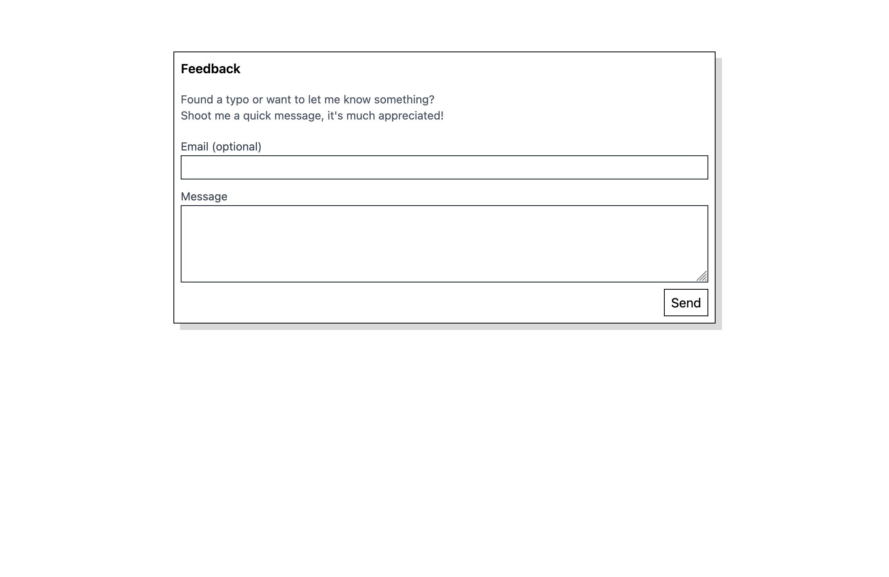

import {Info} from 'src/components';

At work I tend to juggle a lot of links to different tools, confluence pages and other resources.
As you do, I would maintain as many folders of bookmarks as my bookmark toolbar would allow. Visiting
a link involved rerunning the mental process that led me to save it at its particular place in the folder
hierarchy, then arduously clicking around until I got where I wanted to.

I figured there had to be a better way, so I set out to build `go`.

<Info>
  Much of the technical details I will skip here as this application works very similarly to 
 [rest.quest](https://rest.quest). I would thus recommend to read [that project report](/notes/rest-quest)
 first.
</Info>

## Features

`go` is a tiny web application that shows you a list of your saved links as well as a search bar
to search through your links. For each link, the date of last access as well as the number
of accesses is shown. Entries are ordered by recency of access.

Clicking on a link naturally takes you there, so does hitting `enter`. `cmd+enter` opens the selected
link in a new tab.

When some search query is entered, the list is filtered down to the matching entries. Both the link
value itself as well as the description are considered in the search. Notably, the
search logic matches each space-separated term separately. In this case this allows filtering 
down to `github` links, and then within those to the ones containing `fl` very quickly.

Hitting `n` opens two input fields that allow adding a new link with description.

Similar to [rest.quest](https://rest.quest), this application is local-first. In fact, you
can visit it [right now](https://go.rest.quest) and start using it without any signup.
If you do want to synchronize your bookmarks across devices or have them stored off-device for
redundancy, you can enter credentials for an S3-compatible storage provider in the application.
It then syncs its state to the provided bucket. More details about the inner workings of this
can be found [here](/notes/rest-quest).

Most of my applications also boast a feedback function. I find myself encountering buggy software with
no way to report it to the developers to often to not add a feedback channel to my own software.

The landing screen of the application also doubles as the help screen, explaining all functions and
how to navigate around. The lack of buttons or nav element is equal parts laziness as well as 
a brutalist stylistic choice. The least I can do to help someone get started is add a help screen.

### Bookmark dump import

Once I was ready to start using this application full time, I needed a quick way to port over
my links from Firefox bookmarks. To this end I built a crude import mechanism that traverses a JSON
dump from Firefox's bookmark manager and imports all the links into `go`.

After this, I've never used the feature again, so use at your own risk.

### Browser keyword search

The absolute _killer feature_ of this application I didn't even anticipate. A happy little accident
if you will. As I was working on `go`, someone pointed out to me the keyword search feature of Firefox
in an unrelated conversation.

If you're unfamiliar: Visit e.g Google Maps, right click in the search bar and select 
`Add a keyword for this Search`. Now, you can enter e.g. `maps` as the keyword. Now you're all set.
Open a new tab, enter `maps zurich` and hit enter: You're automagically presented with Maps, focused
on Zurich.

The way this works is very simple. Notice how `maps zurich` opens Maps with a `?q=zurich` query param
(briefly before it changes the URL). Maps knows to use this query param as a search input.

Needless to say that this immediately lit up an idea in my head. I can implement the same in `go`, 
but not only do I pull the search term from the query parameter and pre-filter the results in the list,
I also directly visit the link if only one result is left!
In other words, if I search for `gith prof`, the only match is https://github.com/beingflo (due to
the description containing `profile`). With the keyword search set up with keyword `go`, I can now
open a new tab, type `go gith prof`, hit enter and end up directly on the page I wanted to go.

The joy of using this is hard to overstate. Especially in a work context, this has turned many 
frustrating moments of searching for that elusive link into a breeze. I've been meticulously 
adding any link I think I might need in the future to `go` with a good description. Now whenever 
some coworker is looking for that _release plan_ that was presented last week, I'm the one to pull 
it up in 3 seconds.

It feels like everyone else is stuck in the stone age with their bookmark folders.

## Learnings

Despite `go` being one of my smallest projects, it is one of the most impactful. I use this thing
probably a hundred times every single day, saving me some time and, more importantly, nerves.
This project has encouraged me to look for those tiny inefficiencies in my workflows and try to
envision improvements. It also really goes to show how little effort is needed to massively improve
your personal interaction with _whatever_, if you're willing to build your own software.

The keyword search gets most of the credit for how cool this project turned out. I couldn't believe
that I, a self proclaimed power-user of Firefox, missed this feature for over a decade.
Now I've been thinking about more ways to leverage it: When I built [fieldnotes](/notes/fieldnotes),
I didn't know about it yet, so opening a note I already know the title to involves more clicks than
it should. For [jour](https://jour.rest.quest) (project report is in the plans), adding a new
journal entry could also benefit from a keyword. The possibilities are endless.
