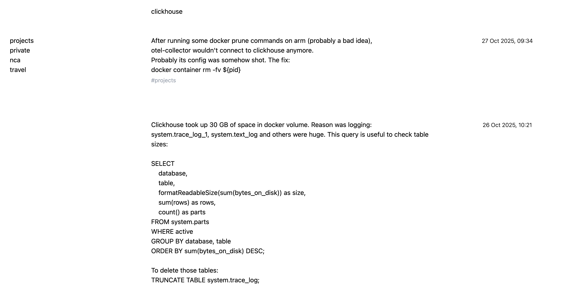
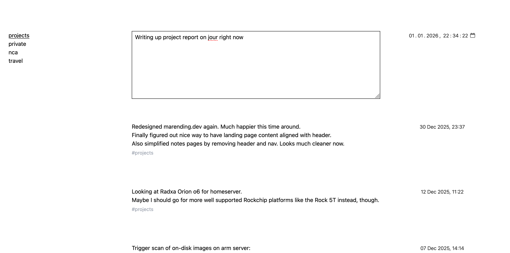
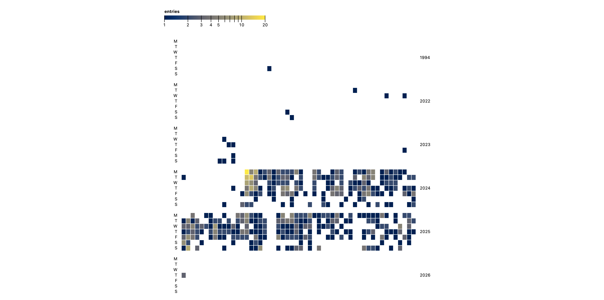

Years ago I stumbled across a [blog post on lab notebooks](https://sambleckley.com/writing/lab-notebooks.html).
The author argues that practitioners in many fields keep a journal where they
detail what they're up to, what's working and what's not etc. in their daily work.
For some fields such a journal even has legal implications when patents were disputed.
In software engineering however, this is not widespread. At the time I read the post I knew
of no one who kept such notes. 

Sure, we have documentation (maybe), but that's not the same thing. Documentation is there
to explain how a system works, how to interact with it, maybe what constraints it operates
under. But documentation typically doesn't explain _how_ and _why_ we arrived at this particular solution.
Did we try to solve the problem in a different way first but failed, leading to the current
approach? You won't find that in the documentation. Old attempts either weren't committed
to the code base or were squashed away.

This blog post opened my eyes to an issue I had at work that I couldn't even put my finger on
before. In my current project at work, I often run into situations where we're reevaluating
a design decision from two years ago because someone thought of a better way to do it.
Inevitably, no one remembers _why_ it was built the way it is. But I would often have this
nagging feeling that we considered the proposed solution back then but decided against it
for _reasons_. Now the big question (possibly worth weeks of effort) is whether we just
didn't think of it back then or whether we're missing the reason now for why we didn't do it.
Or, some surrounding factor changed in the meantime, now enabling the better approach.
If I had kept notes on my attempts, failures, assumptions etc. I could simply read up on
this now and we would have clarity. Alas, those notes don't exist.

Naturally, I resolved to start a lab journal. But instead of using my usual 
[notes app](/notes/fieldnotes), I had the feeling I needed something more specialized for
the occasion. An application that would keep entries in a chronological feed, rather than
siloed notes. Enter [jour](https://github.com/beingflo/journal), a simple web app for
keeping journal entries with no hassle. It's local-first with optional S3 sync.
A hosted version is available at [jour.rest.quest](https://jour.rest.quest/).
As you can tell by the URL, this application is another instance of my local-first series
kicked off by [rest.quest](/notes/rest-quest). I would recommend reading that project report
first for the technical details, here I will only go into the feature set and learnings from
this project.

## Features

If you've seen the project reports for [rest.quest](/notes/rest-quest) or [go](/notes/go-rest-quest)
you know the drill by now: Brutalist, minimalist UIs are my jam. Below is the default
view of jour, a complete feed of every entry I've written in reverse chronological
order. Each entry has a text body, some tags and a date. The tags are parsed out of
the content when submitting an entry simply by looking at words starting with a `#` in
the last line. Tags do not get special treatment other than being displayed in a lighter
tone below the content.

On the top, there is a search bar that searches through all entries and filters down the
feed accordingly. I started using this application a while ago and was quite satisfied with it.
The one gripe I had was that when I was writing entries at work, I wanted to automatically have
the entries tagged by a special tag (`nca` in my case). Instead of always having to type out
this tag manually, I later added the things you see on the left. When clicking on `nca`, there
is an implicit filter for this term that doesn't show up in the search bar as well as every new
entry automatically gets tagged correspondingly. These "autofilters" can be created via shortcuts
and deleted via a button that is revealed on hover.

Next, by hitting `n`, a new entry is created at the top with a textbox and a date picker.
By default the datepicker shows the current date and time, but I quickly found that sometimes
one wants to create entries in the past, so I added the ability to set the date. 
With `cmd+Enter` the entry is saved.

That's pretty much the functionality that I use every day. One additional bit of eye-candy I added
later is a statistics screen that can be toggled. It shows a GitHub-style heatmap of all 
entries laid out over time.

Here you can see that I'm quite consistent in using jour. The week(s)-long gaps are almost
always vacations.

## Learnings

Technologically, jour is nothing to write home about. It's a slight variation of my
rest.quest-winning-formula. That's also the reason I could build this out in a mere couple
of hours. The interesting learning for me in this project is more in the direction
of disjoint, use-case-specific applications vs integrated multi-purpose apps.
At first, I was very happy with my new-found trifecta of productivity applications: 
jour as a lab journal, [rest.quest](/notes/rest-quest) as a todo list and
[fieldnotes](/notes/fieldnotes) as the notes app. Over time, I started noticing
an indecisiveness on where to record some things. For instance, after figuring out a shell
one-liner to fix an issue I was experiencing, I wouldn't know whether to jot this down
in the lab journal or as a new note in the notepad.

This conundrum has kicked off thoughts I can't fully verbalize yet. In classical _me_
fashion, one option in the room is to build an integrated application that allows bringing
all this data together. But then again, moving away from single-purpose, focused applications
to bloated monoliths doing too many things badly is not exactly a mistake I want to 
repeat. We'll see where this goes.