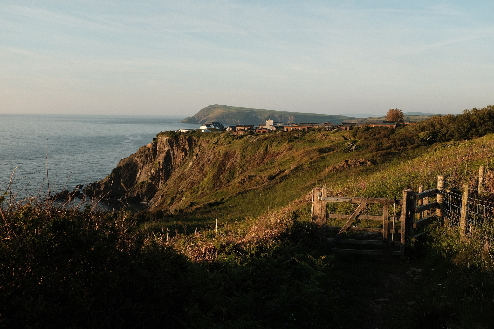
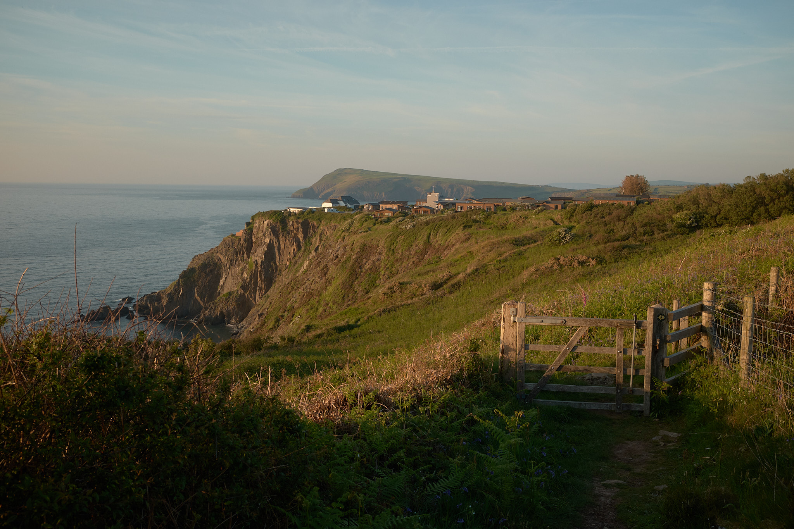
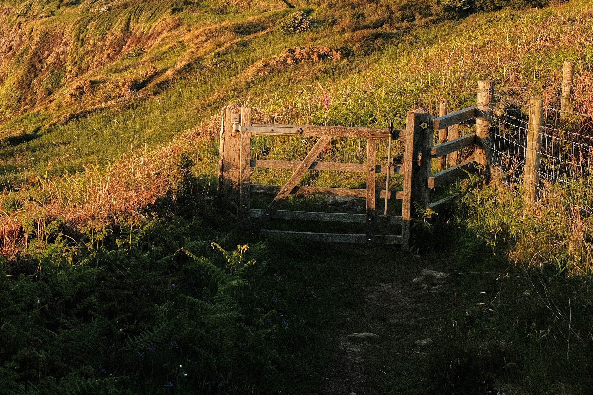
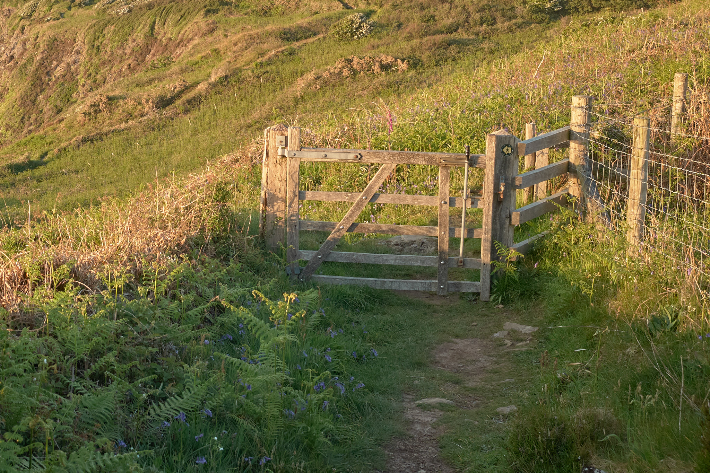
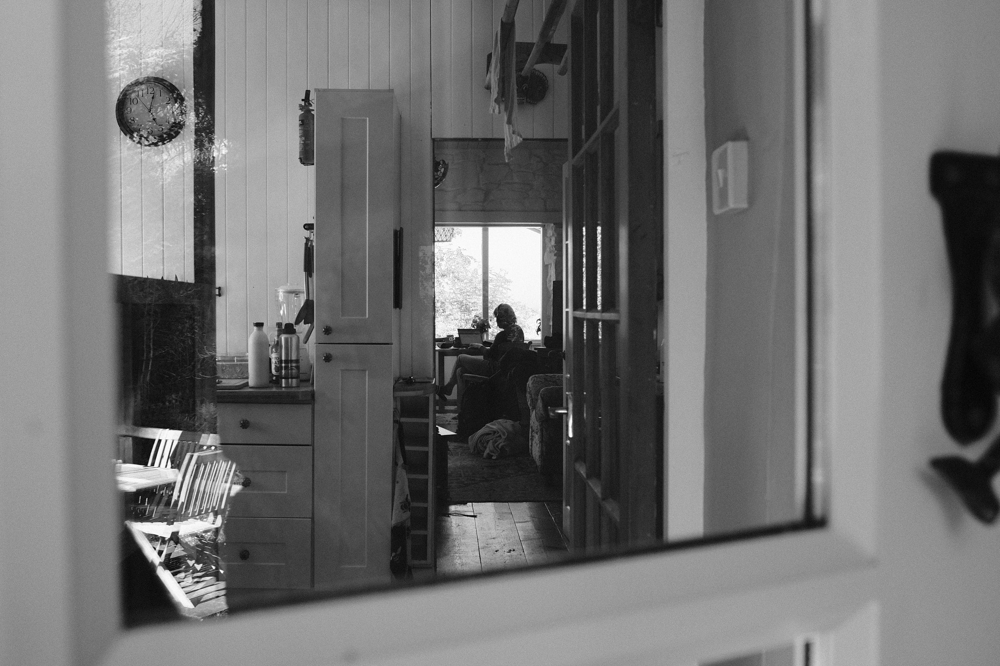
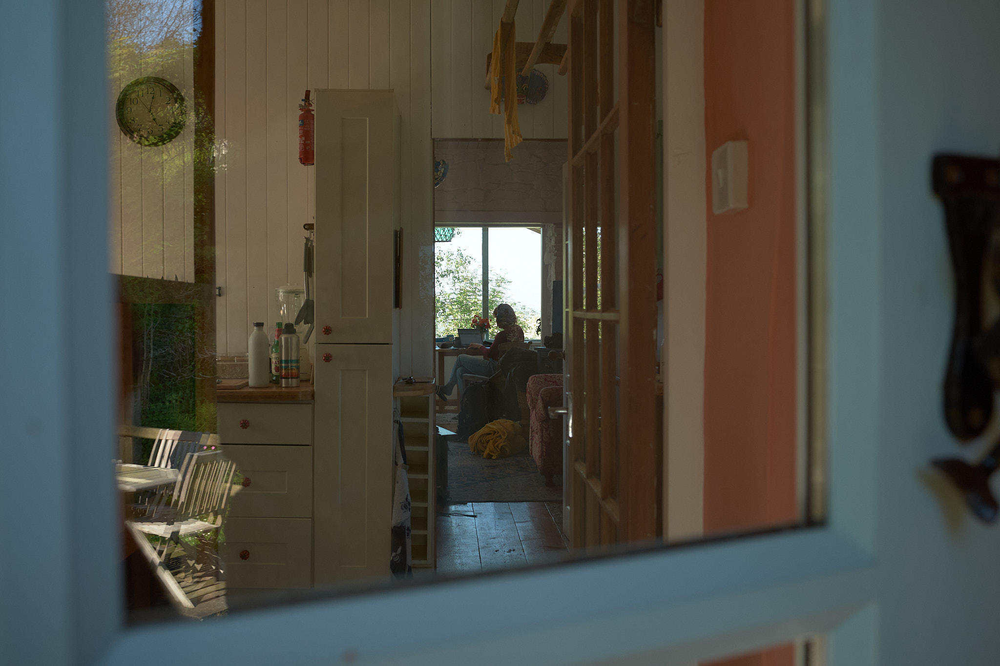
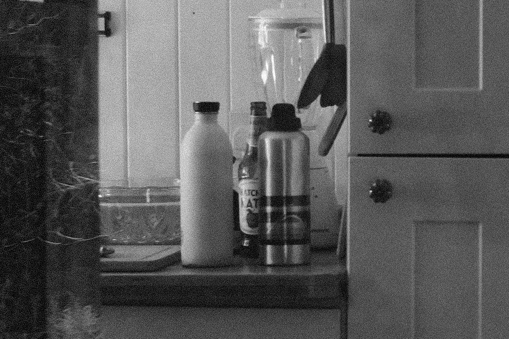
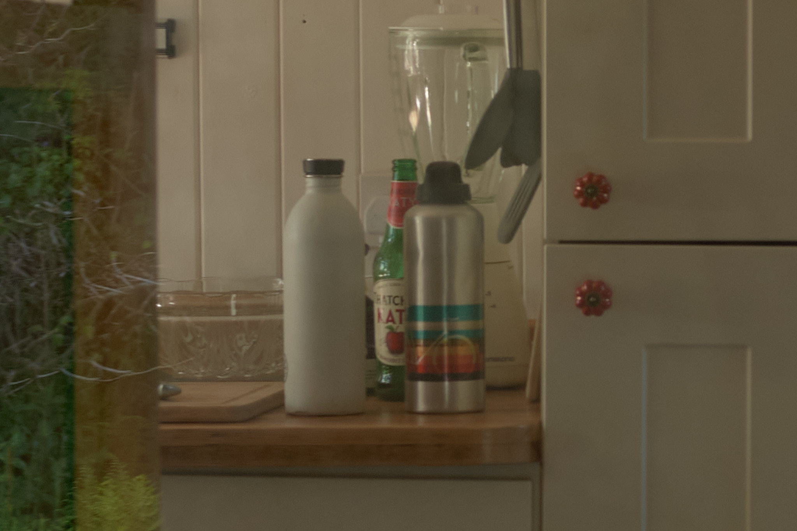

import { Hint, Details } from 'src/components';

I've been taking pictures on vacation, around the house and out and about with friends for a 
couple of years now as a way to document life. But after all this time, I'm still
not happy with my photo workflow. In a departure from my usual technical musings, in this
note I'm exploring one of the age old questions the old philosophers already asked.

> Should I shoot JPEG or RAW on this thing?
>
> - Plato

This is one of those notes where I'm mostly trying to pelt my thoughts into some cohesive form.
There may or may not be anything to see here for you.

## Some background on (Fujifilm) image formats

I shoot with a Fujifilm X100F. Fuji cameras come with so-called _film simulations_, a fancy way to say
you can tweak the JPEG output of your camera. Every other camera manufacturer offers the same, but some
say Fujis JPEGs are nicer. I can only compare to Olympus JPEGs, where every single profile other than
the standard one _does_ look terrible. Either way, for me that means that no matter how long I stare
at an image in an image editor, I can never get it to look as nice as a Fuji JPEG in the
Classic Chrome look 👌.

These film simulations are so infamous at this point that there are [entire websites](https://fujixweekly.com/2017/08/27/my-fujifilm-x100f-classic-chrome-film-simulation-recipe/) 
dedicated to curating Fuji _recipes_, which include the simulation itself as well as other parameters 
that can be tweaked.

Now, when I shoot JPEGs I'm getting these nice colors out of the box. But those very colors (or that 
lack thereof in case of a B&W recipe) are backed into the file. It's hard to recover from that.
If I crushed those shadows as a stylistic choice in camera, I'm not getting them back.
That's what RAWs are for: These files are more or less raw sensor readings from the camera. Maximally
flexible, maximally boring and flat without any editing applied. Here are some axioms about these
files:

- You can always recreate JPEGs from RAW
- You can never recreate RAWs from JPEGs, or even, say, color JPEGs from B&W JPEGs

It's a one-way street. As for the first point, you can even get those authentic Fuji JPEGs thanks to
[X Raw Studio](https://www.fujifilm-x.com/de-ch/products/software/x-raw-studio/). This piece of software
allows you to send RAW files through your physical cameras JPEG engine to get the
very same result as if you had shot JPEG in the first place.

Alternatively of course, you can wrangle RAWs into any grid of pixels physically possible (including
those magical Fuji pixels) via a RAW editor. From this property, the age-old wisdom originates: Beginners shoot JPEG because they don't any better,
everyone else shoots RAW.

## Where am I coming from?

I currently shoot RAW+JPEG because I like the JPEG colors, but I also like the flexibility and 
freedom to stop liking them in the future. But that's where the trouble starts. Now I have cull 
those image. How do you look through images on your disk that occur in pairs and delete the bad 
ones? You can use specialized software that understands that `DSCXXX.jpeg` and `DSCXXX.raf` are 
the same image and should be treated as such: Deletion of the image should remove both files. 
On macOS, such software is surprisingly elusive and / or expensive. So, as you do, you write a script for it.

```bash
mkdir ./trash
for file in ./raw/*; do
  [[ $file = *.JPG ]] && continue  # skip .JPG files
  jpg_file=$(basename ${file%.*}.JPG)
  [[ -s ./jpeg/$jpg_file ]] || mv "$file" ./trash
done
```

Here's how this works: When I plug the SD card from my camera into my computer, I get a folder with
images, each a `.jpeg` and a `.raf` version. I then copy the JPEG files into a `jpeg` folder and the
RAW files into a `raw` folder. Then I cull the JPEGs with Preview. Once done, I run the above script,
which moves all the RAW files into the trash folder, that don't have a corresponding JPEG image.

This makes the culling process bearable. But now what? I enjoy the JPEGs coming out of my
camera (I spent considerable amount of time researching recipes, they better) so 
I don't need to do any heavy color correcting or such. But I still need to make the occasional
exposure adjustment, leveling or crop. So, after months of deliberation, I purchased a license for
[Capture One](https://www.captureone.com/en) for an eye-watering 300 bucks a while back.
I import the JPEGs into CO and do my light adjustments, then I export them at some arbitrary resolution
and quality setting. That's it, those are my images now that I occasionally look at.

I've started printing my images as well, lately. For this, I also take the original JPEGs and edit them to get them
to look the way I want out of the printer (the damn thing always skews magenta).

Oh the RAW files, what happened to them? Well they get chucked in a backup somewhere, in case I need
them in the future. I rarely do, but you never know. In an unrelated thought the term 'data hoarder' comes to mind.

This workflow is somewhat convoluted, that's why I'm reevaluating it. I don't like that I have to
juggle two file types. I don't like the indecisiveness of wanting to make decisions in-camera, but then
keeping a backup just in case. I also don't like that with my (non-destructive) edits on the JPEGs in 
Capture One, the "source of truth" is in a proprietary database file of this editor and _not_ some standard
image files.

<Hint>
  Now this right here is the reason I'm writing notes like this. Only when trying to verbalize the reasons
  I dislike my workflow did this fugitive thought crystallize. Writing is thinking and all that jazz.
</Hint>

Now that I think about it, I _really_ don't like that the whole Capture One catalogue is _the_ source
of truth for my creative work when it's so messy. E.g. when I lightly edit an image as usual for digital
usage it looks very different from the edit for print. These two versions show up in my CO catalogue.
This feels messy, call me old-fashioned but I want to use OS directories to organize my images, not
proprietary, non-transparent, custom behavior of _some_ piece of software.

I do have a perpetual license, so I shouldn't expect to lose access at some point but it still doesn't 
sit right with me. Oh boy, going into this I didn't want to question my use of Capture One, I paid good
money for it after all. But here we are, let's see where this goes.

## What _do_ I like?

First, want I care about when out and about taking pictures:

- I want to choose settings in camera
- I want a simple shooting experience (optical viewfinder)
- I don't want to have to think about post-processing

I've shot analog film for a while and learned to love the simplicity of it. This is part of the reason
I enjoy the X100F so much, it offers a hybrid optical / electronic viewfinder as well as a whole bunch 
of physical dials for setting exposure. I would love to use the OVF more, I often avoid it because
I worry that I get the wrong exposure in-camera if I'm not previewing it through the EVF.

I would also like to choose what type of image I'm taking when I take it. I want to decide to shoot
B&W in-camera, I don't want to sit in front of a computer after the fact for hours, pondering which
image might look nice in black and white.

Next, what should my workflow look like after I'm done taking pictures:

- Simple. I don't want to spend much time editing, culling and otherwise managing photos
- Flexible. I want to be able to change my mind later

Now here is an interesting dichotomy, the flexibility here is completely at odds with choosing settings
in-camera above. When taking pictures I don't want to be babysat by post-processing Me. At the same time
I don't want to facepalm in front of my computer, looking at hundreds of overexposed images that some
buffoon with a camera took.

I think the flexibility in post-processing has to win out. I've taken wedding pictures before where
a series of bad decisions led to some where ghastly pictures. It was very fortunate I had the RAW files
to put through X Raw Studio and get reasonable JPEGs out.

## What about image quality anyway?

In a small intermezzo I also want to briefly take a look at how malleable JPEG and RAW files are, maybe
that will also yield some interesting point to consider. Though I'm generally plenty happy with my JPEGs.

First, here is a straight-out-of-camera JPEG from a recent trip to Wales. This was run through Capture
One just to compress it for web viewing. Wouldn't want to bother you with a 15MB file.


The same image now from the unprocessed RAW file. Note that a RAW file has to be interpreted somehow
to show it on screen. Here, Capture One is used to convert into a JPEG but with no special editing applied
and a linear curve.



Needless to say the RAW file lacks a lot of contrast that could obviously be added if desired.

But what if I wanted to recover some shadow details at the bottom of the screen?
First a crop of the JPEG with shadows lifted, then the RAW file:




This is the flexibility of RAW files. It's really no competition. In the JPEG the information has simply
been compressed away while the RAW file maintains it.

Next, let's look at a black and white image. Here, I have used Fujis ACROS simulation for a nice look.
Below is again the RAW file with a linear curve.




Zooming in to a section of the image reveals the grain that I configured in my B&W recipe. It just looks
really nice. Yes, I add artificial film grain to my images, I'm that kind of a hipster.
Again, this look could be reproduced from the RAW file, it would just require significant
effort that I'm not willing to spend.




## Capture One tone curves

But here is an interesting thing I just learned while writing this note: Capture One has tone curves 
that mimic Fujis film simulations. Supposedly they even worked with Fujifilm to get them to match closely.
This means I can take RAW files, set the tone curve to `Auto` and CO will choose the appropriate curve
as selected in camera. For this, it will read the metadata embedded in the file and select the appropriate
simulation. I could still override it by specifically choosing e.g. Eterna on an image that was shot on 
Classic Chrome.

Looking at those curves through my untrained eyes, it seems they match quite well. There are some differences
like the lack of vignette control in the curve vs Fujis JPEG engine. This is kind of expected and can easily be
fixed for all images that are imported.

## So what are my options?

- Shoot JPEG only
- Shoot RAW only
- Shoot RAW+JPEG

Shooting only JPEG is not an option. It's too risky not to be able to reprocess images if rough mistakes
happen or my stylistic choices change.

Shooting only RAW sees two sub-options in my opinion: Either I plan to shoot RAW and then run them through
X Raw Studio to get JPEGs out, or I run them through Capture One to edit and get JPEGs out. The first
option is kind of pointless, might as well shoot RAW+JPEG then as the editing capabilities of X RAW Studio
are very limited.
So RAW -> Capture One -> JPEG is the only viable path for this option.

Lastly, shooting RAW and JPEG is where I'm currently at. The only thing I could vary here is using the RAWs
as starting point for editing rather than the JPEGs. But at that point I might as well just shoot RAW only.

<Hint>
  To be continued...
</Hint>