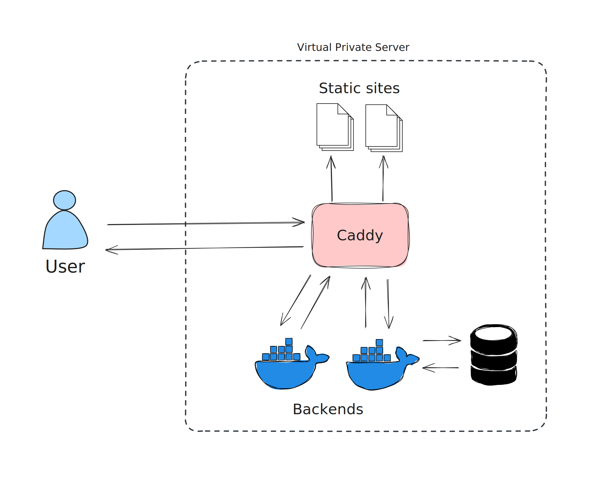

I'm writing a bunch of software for myself as a hobby. Most of this software requires
a server to function, be to store data or to serve a web application.
I've gone through a couple of iterations on my hosting setup over the years and finally,
I've arrived at one I'm quite content with. I will take you down a path of simplification
and, incidentally, back in time.

## Few dependencies

Software like mine has no special requirements, many have built similar software before and many
will after. There are dozens of ways to deploy and host backend servers, databases and static web
applications. Many of those ways try to abstract complexity away from you, pushing it down into
an infrastructure layer. That sounds appealing, but if you give in to the temptation you're dependant
on that machinery. I like to avoid that and make sure I control the whole stack. This doesn't have to 
be as hard as cloud vendors make it sound. They have an interest in making you believe you can't
administer a database by yourself after all.

To get more specific, I don't like platforms as a service like [Vercel](https://vercel.com/). They
promise to get you started quickly, but in the process you lose flexibility, independence and your
money. Instead, I'm opting for a virtual private server, a bare linux box if you will. It represents
the foundational unit to run software on. You can spin up a VPS wherever you want, even on your
own hardware if you want, there is no lock-in.

Further, I've largely stopped using auxiliary services to enable deployments, backups or whatever else
you may want to do. Again, there are platforms that promise you a seamless experience, for just a
little bit of your hard-earned money (or data). But I've found that for my purposes I can do without.

## Architecture

My setup is entirely dockerized. I run [Caddy](https://caddyserver.com/) as my central web server that
fulfils multiple roles: TLS termination, static site serving and reverse-proxying. All my frontend-only
projects are simply bundled and chucked into a folder for Caddy to serve. All my backends are dockerized
and spun up alongside Caddy, which proxies requests appropriately. All my domains have automatic
SSL certificates issued by [Let's Encrypt](https://letsencrypt.org/), all managed by Caddy.

It's quite simple, really.

## Deployment