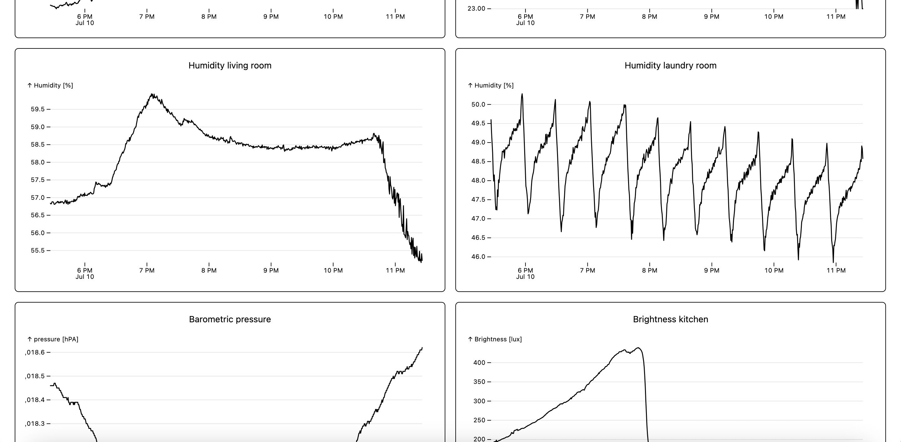
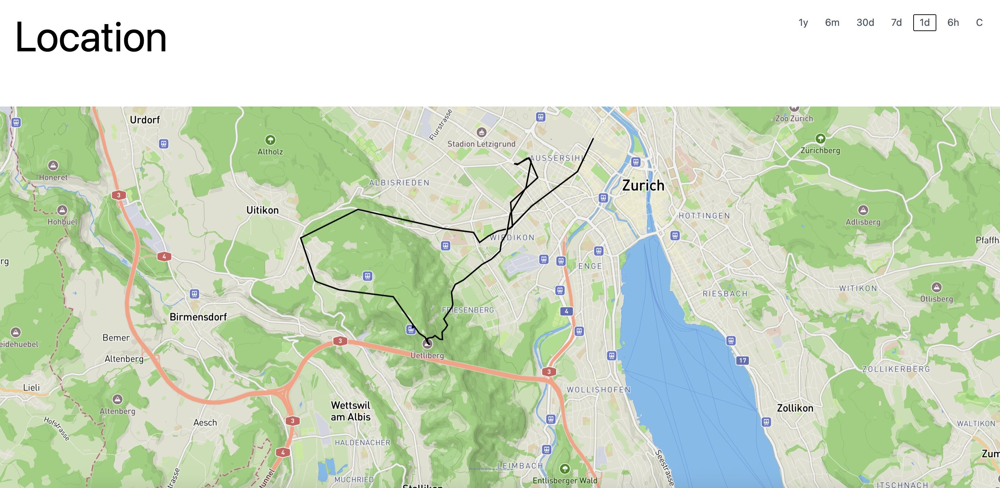
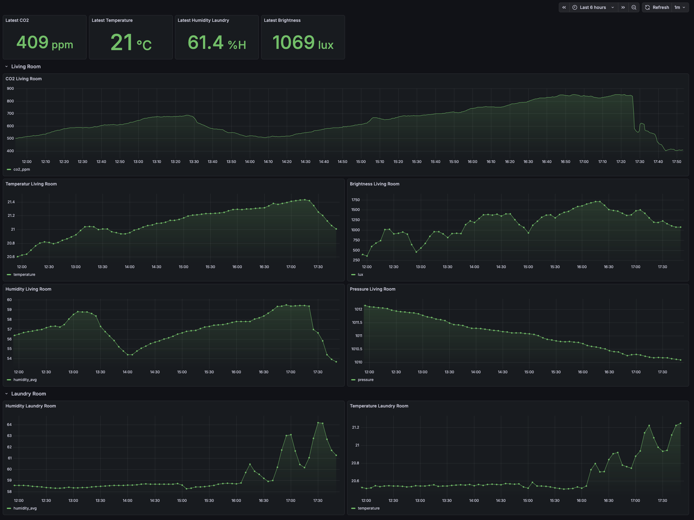
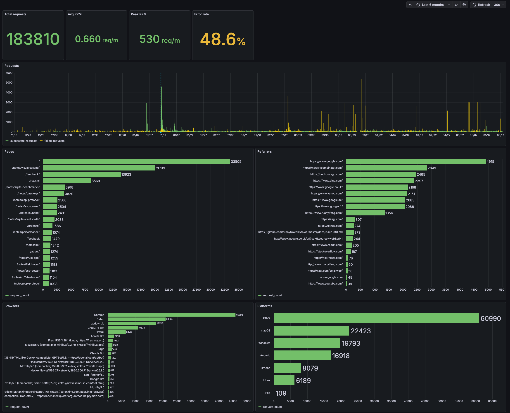
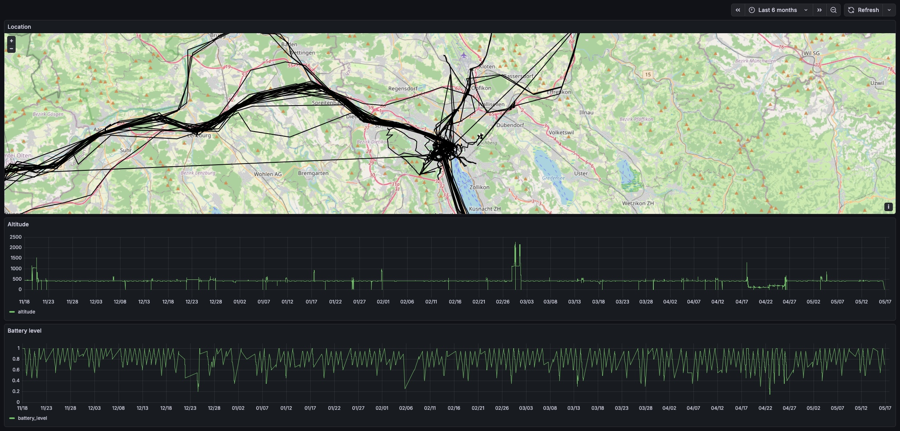

I like to think about how to get operational insights into the services I host. It's become kind of
a hobby, to be honest. Maybe this whole thing is just bike shedding. What better way to avoid the
crushing reality that an actual project you had in mind doesn't live up to your expectations than by
not even attempting it, and instead building infrastructure around your existing applications? Maybe
that's a topic for therapy.

Anyhow, I realized during my latest manic observability episode that I barely even remember how I
got here. So for posterity, I'm outlining the history and motivations for all the different phases
in this note.

## Act 1: Metrics and Prometheus

A couple of years ago I got the itch to play around with embedded devices. I got myself an ESP32 and
a CO2 sensor and got to work. With a little elbow grease, I had the current CO2 concentration
displayed on a small seven segment display. Soon, I graduated to wanting to store and chart this
data.

At this point I had little knowledge on how to approach this, so I went the well-trodden path:
Prometheus to store time series data and Grafana to visualize it. Since my microcontroller was not
internet accessible, I had to put a [push gateway](https://github.com/prometheus/pushgateway) in
front of Prometheus to allow pushing data into the system, instead of having Prometheus scrape the
metrics off the device on a regular schedule.

Around this time I also built and deployed this website. I had seen a cool statistics section on
another blog, where one could view how many page views the blog was getting and which pages were
popular. Wanting the same for this site, I initially transformed the static site into one with a
NodeJS backend just for this feature. After a short while I realized I wasn't happy with that and
ripped it out again, planning instead to track visitors with an external service. You can watch this
unfold in [this old note](/notes/performance/).

I could have used my existing Prometheus setup to scrape Caddy for access metrics, but that wouldn't
have given me all the data I wanted. I'd need
[a dedicated service serving the site](/notes/rust-spa/) and exposing metrics. So this kicked off
the realization that I needed a broader observability system than what Prometheus could give me.
What was always clear to me, by the way, is that I wanted one unified system for metrics and service
monitoring.

In hindsight, I also realize there was another push factor: PromQL. I got annoyed with learning a
language with such a narrow use case.

## Act 2: Metrics with DuckDB

With all this in place, the time was ripe to venture out. And boy did I. The requirements for my
next system were clear: it should accept arbitrary JSON payloads (like sensor readings or access
logs), store them efficiently, and allow querying them in an ergonomic fashion.

Notice the shift away from time series data to something more general, something that could cover
multiple use cases. You can follow the journey from
[musing on how to store that data](/notes/unstructured-data/) to
[benchmarking suitable databases](/notes/sqlite-vs-duckdb/) in my notes.

Coming away from PromQL, I was craving more expressive power for querying and transforming data. So
I started looking into building [a WebAssembly plugin system](/notes/wasm-benchmark/) to safely
execute efficient transformations server-side. For visualization, I wasn't satisfied with Grafana
anymore either — I wanted to go custom there as well. So I built a SolidJS frontend with
[responsive plots](/notes/responsive-plots/) using Observable Plot. All this started taking shape
under the name [observatory](https://github.com/beingflo/observatory).

You might already be guessing that this would not go so well. Indeed, the sensor readings and GPS
location data from my phone were handled fine, but I was missing a puzzle piece on how access logs
fit in. How would I instrument my services in such a way as to get the data into observatory in a
queryable form? I found the answer in the form of
[traces](https://opentelemetry.io/docs/concepts/signals/traces/). At first I wanted to build a
tracing collector into observatory, but that proved to be difficult. Instead, I turned towards a
more off-the-shelf stack to ingest tracing data.

## Act 3: Tracing with ClickHouse

When I learned about tracing — not just in the context of distributed systems, but the general
concept of spans and events — I felt like I had hit the jackpot. Events you emit within spans mimic
log lines, except they are naturally associated with a particular request. No correlation id needed
(it's the span id, and the tooling handles it for you). Metrics are just hardcoded aggregations done
in the application, which lends itself to very space-efficient storage in exchange for limited
flexibility. With traces, you can generate any metrics you might care about after the fact. Tracing
is kind of a one-stop-shop for observability.

So I set up an OpenTelemetry collector that would receive traces and store them in a
[ClickHouse](/notes/clickhouse/) database. That part made a lot of sense, and instrumenting my
services with the excellent `tracing` crate is a walk in the park. Getting that sent off
[not so much](/notes/otel/), though. But now the sensor and GPS data didn't fit the bill so cleanly
anymore. I didn't want to have to send that data in a format the collector would understand, so I
built a small service I called [events](https://github.com/beingflo/events) that accepts the data
and simply declares a span with the received attributes. This way, the tracing machinery in _that_
service takes care of getting the data into ClickHouse (via the collector).

So with this, I finally realized the dream of having one central system where all my data flows
together:

 

So this is great. Just a couple of problems:

**I don't like OpenTelemetry because I don't understand it.** I would prefer simpler protocols,
something I could build myself in a pinch. The docs are a mess, too.

**I don't like operating ClickHouse and Grafana on my server.** They're great at what they do, but I
have a need for simpler software. I suffer from not-invented-here syndrome, ok?

**I don't like the way the data is laid out in the DB.** I can put any data into the DB just by
annotating a function with a span, no problem. But it's very inefficient at storing, say, an 8 byte
sensor value. The fact that each span is its own row also makes aggregating data across all spans
belonging to one request quite tedious.

I'm craving simplicity.

## Act 4: Wide events with Parquet

For more background on this, please read the
[preceding note on Parquet files](/notes/duckdb-parquet/).

Apparently other people have had the same thoughts. Some call it Observability 2.0, others wide
events. I'll give you a brief rundown; for more details and a good list of further reading, consult
this [blog post](https://jeremymorrell.dev/blog/a-practitioners-guide-to-wide-events/).

The idea is simple: for a "unit of useful work", whatever that means for your system, collect an
object with relevant properties and send it off to your observability system upon completion of the
work. For a web backend, the unit of work you care about most is almost certainly the handling of a
request. But it may also be the execution of a scheduled task. So for the request, you would track
url, method, response status, headers, and all the usual suspects. But if you go all the way, you
may even add current memory utilisation and other environmental factors.

Fundamentally, this is not that different from traces applied to a monolith. The data is just more
easily queryable. And what I particularly appreciate: no need for sophisticated machinery.

The plan is, once again, simple: build a system that accepts arbitrary JSON payloads. Regularly
write the buffered payloads into Parquet files. That's it. That's the write path. To visualize the
data, I'll build custom dashboards just like in Act 2. The storage engine enabling fast queries will
be DuckDB. Instrumentation on the services should be rather straight-forward as well. All I need to
do is keep track of some context throughout the handling of a request to write properties into.

What I'm hoping to achieve with this approach: a simpler wire protocol that any service and device
can directly talk - just JSON. A simpler data model, plain files for easier backup. A simpler
operating model, no queries, no load. More powerful and elegant visualizations. The simplicity I'll
gain of course comes at the cost of significant effort to build this system. But I'm more than happy
to pay for it.

Watch out for a project report on `events-v2` to see how this turns out.
